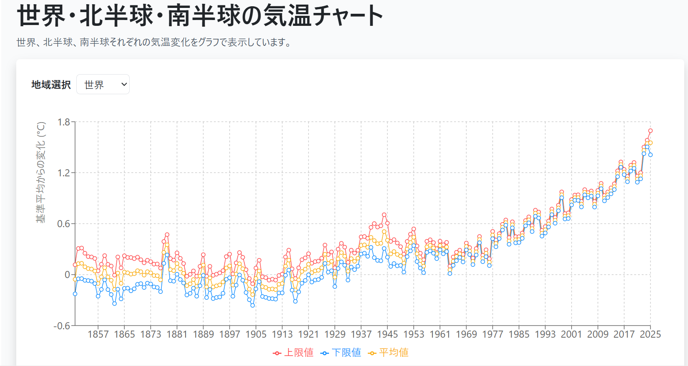
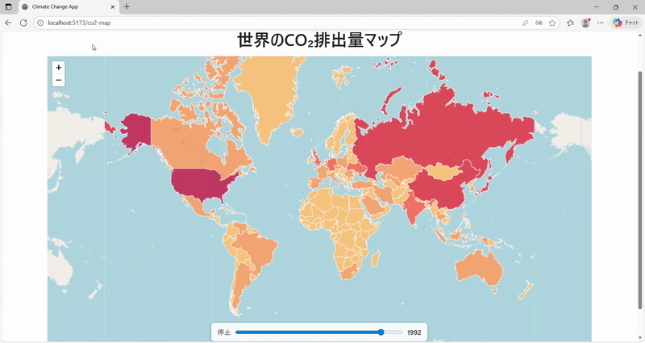

# 気候変動データアプリ v2

Django REST Framework と Next.js を使った、気候変動データの可視化アプリです。[気候変動データアプリ](https://github.com/tomoki-shiozaki/climate-change-app)のフロントエンドを Next.js に移行したバージョンです。

## 使用技術

- Django REST Framework, Next.js（App Router）, PostgreSQL
- Vercel / Render（デプロイ環境）
- GitHub Actions（定期バッチ処理）

## 機能

- 気温データの時系列グラフ表示
- 国別 CO₂ 排出量の色分けマップ表示（年度スライダー対応）
- JWT による認証・ログイン/ログアウト
- [Our World in Data（OWID）](https://ourworldindata.org/) の気候データを用いた定期バッチ取得

## デプロイ URL

1. **推奨環境**  
   https://climate-change-app-v2.vercel.app/  
   フロントエンドは Vercel、バックエンドは Render にデプロイ済み。
   ※バックエンドはスリープ復帰に時間がかかる場合があります（目安：最大約 50〜60 秒）。

2. **代替環境（Render 上で動作）**  
   https://climate-change-app-v2.onrender.com/  
   Vercel 環境が利用できない場合の代替として用意しています。
   フロント、バックエンド両方を Render にデプロイ済み。
   ※フロント、バック両方で起動時間がかかります。（目安：フロントは最大 40 秒、バックエンドは最大約 50~60 秒）。

## デモ用アカウント（ポートフォリオ閲覧用）

※ 本アプリはログインが前提のため、動作確認には以下のアカウントをご利用ください。

| ユーザー名 | メールアドレス   | パスワード       |
| ---------- | ---------------- | ---------------- |
| demo_user  | demo@example.com | climate-demo-123 |

## 気温変化グラフ

## CO₂ 排出量マップ（年度スライダー）

年度スライダーを動かすことで、各国の色分けが変化します。（自動再生機能あり）

## ドキュメント

- 詳細なシステム構成、開発構想や設計案などは
  [docs/README.md](docs/README.md) をご覧ください。
- ※本ドキュメントには開発構想や設計案も含むため、実装と完全には一致しない場合があります。
