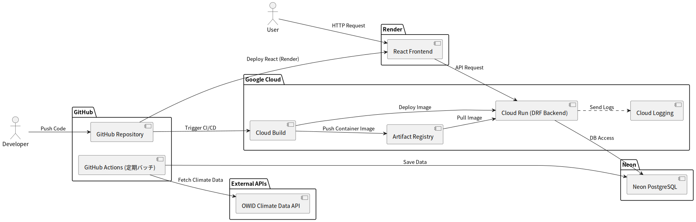

# 気候変動データ可視化アプリ開発プロジェクト

> ⚠️ 本ドキュメントは開発構想や設計案を含むため、実装と完全には一致しない場合があります。

## 1. プロジェクト概要

- **プロジェクト名：** 気候変動データ可視化アプリ開発プロジェクト
- **前提：**
  - 気候変動関連のオープンデータ（気温、CO₂ 排出量、エネルギー消費など）は [Our World in Data (OWID) ](https://ourworldindata.org/)の API や CSV として整備されている。
  - GitHub Actions を用いて OWID のデータを定期的に取得し、Neon PostgreSQL に蓄積する構成を採用。
  - バックエンドは Cloud Run（Django REST Framework + PostgreSQL）、フロントエンドは Render（React）で運用。
- **データ例：**
  - 世界平均気温の変化（年次）
  - 国別・年別 CO₂ 排出量
  - エネルギー関連指標（化石燃料比率、再生可能エネルギーなど）
- **開発目的：**
  - フロントエンド（React）とバックエンド（DRF）をクラウド環境で運用するフルスタック開発の実践。
  - CI/CD、インフラ（GCP、Render）、バッチ処理（GitHub Actions）など、実務レベルの構成を経験する。
  - 公共データを扱うアプリを通して、データ処理・API 設計・非同期処理の経験を積む
  - 、ユーザーが直感的に気候データを理解できるインタラクティブな可視化体験を提供する。
- **現在の実装状況（MVP 実装内容）**

  - GitHub Actions による定期バッチで OWID データを取得し Neon DB に保存
  - DRF による API（CO₂ 排出データなど）を Cloud Run 上で提供
  - React（Render）で気温変化のグラフ表示・CO2 マップなどの UI を提供
  - エラーハンドリング・ローディング UI、簡易的な説明文・出典表示を実装

- **今後の拡張予定**
  - 気候指標の追加（再生可能エネルギー利用の推移など）
  - 各国・地域の個別ページ作成
  - 国比較やフィルタリング機能の拡張

---

## 2. システム構成図（アーキテクチャ）

本プロジェクトの全体構成は以下の通りです。  
フロントエンド、バックエンド、データベース、定期バッチ処理の関係を示しています。

### 説明

- **フロントエンド**：React + Render
- **バックエンド**：Django REST Framework + Cloud Run
- **データベース**：Neon PostgreSQL
- **定期バッチ**：GitHub Actions が OWID API からデータを取得し DB に保存
- **CI/CD**：Cloud Build → Artifact Registry → Cloud Run、フロントは Render に自動デプロイ
- **ログ・シークレット管理**：Cloud Logging / Secret Manager を利用

---

## 3. ターゲットユーザー

- 気候変動に関心のある一般ユーザー・学生・学習者
- 各国のデータを比較・観察したい人
- 環境問題を「データから」理解したい層

---

## 4. 利用シーンの想定

- 世界全体または特定地域の気温変化をグラフで確認
- CO₂ 濃度の推移を年単位で可視化
- 複数の指標を切り替えて比較表示
- （拡張）将来予測やランキング分析を実施
- （拡張）特定の国や期間をブックマークして追跡

---

## 5. 機能定義

### 🔹 基本機能（MVP）

#### 1. データ取得（バックエンド）

- Our World in Data の CSV/API から定期的にデータを取得
- Django 管理コマンドまたは Celery タスクで自動更新
- データ正規化・欠損補完などの前処理を実施

#### 2. データ保存・API 提供

- Django モデルを定義し、PostgreSQL に保存
- 指標・地域・年をキーとする構造化データ設計
- Django REST Framework で API を構築
  - `/api/temperature/`
  - `/api/co2/`
  - `/api/countries/`

#### 3. データ可視化（フロントエンド）

- React + Recharts による折れ線グラフ表示
- ドロップダウンで指標や地域を切り替え
- 年次推移をインタラクティブに表示

#### 4. 解説セクション

- 指標ごとの説明テキストを API 経由で取得
- 出典（Our World in Data）へのリンクを設置

---

### 🔹 拡張機能（Advanced）

#### 1. 比較分析機能

- 複数の地域を同一グラフ上に重ねて表示
- 例：「日本 vs 世界平均」「中国 vs アメリカ」など
- グラフの色分けと凡例表示により視覚的理解を促進

#### 2. キャッシュ・最適化

- Redis による API レスポンスキャッシュを導入
- 同一リクエストに対するレスポンスを高速化

#### 3. ユーザー機能

- JWT 認証によるログイン機能
- お気に入りの国・指標を保存し、ダッシュボード化

#### 4. 自動更新・定期ジョブ

- Celery + Django によるデータ更新ジョブを実装
- スケジューラ（Celery Beat）で定期実行
- 更新履歴を管理画面で可視化

#### 5. データ品質検証

- API レスポンスの自動テスト（pytest + DRF）
- 欠損データや異常値を検出・ログ化

#### 6. コメント・考察投稿

- ユーザーが特定データに意見・考察を投稿可能
- 投稿は管理者レビュー後に公開

---

### 🔹 今後の発展要素（バックエンド強化）

- **統計分析ロジックの導入**

  - 線形回帰で将来値を予測（例：2100 年の気温推定）
  - Django API 側で分析結果を返す

- **異常気象検出ロジック**

  - 過去平均との乖離を算出し「異常年」をハイライト
  - 統計的閾値（Z スコアなど）で異常値を判定

- **データフェッチ戦略**

  - API ダウン時のフォールバック（ローカルキャッシュ）
  - 差分更新により効率的な再取得

- **バックエンドパイプライン設計**
  - ETL 的処理（Extract → Transform → Load）を Django 内で表現
  - モジュール化によりスクリプト再利用性を高める

---

## 6. 使用技術スタック

| 分類           | 技術                                      |
| -------------- | ----------------------------------------- |
| フロントエンド | React, TypeScript, Recharts, Tailwind CSS |
| バックエンド   | Django, Django REST Framework             |
| データベース   | PostgreSQL                                |
| インフラ       | Docker, docker-compose                    |
| 自動化         | Celery, Redis（定期更新ジョブ）           |
| デプロイ       | Google Cloud Run / Render                 |
| テスト         | pytest, Jest                              |
| バージョン管理 | Git, GitHub                               |

---

## 7. 今後の開発ステップ（例）

1. Our World in Data の CSV から気温データを取得
2. Django モデルと API を作成
3. React で折れ線グラフを描画
4. 地域選択・指標切替を追加
5. Docker で環境構築
6. pytest による自動テスト導入
7. Celery による定期更新タスクを設定

---

## 8. 期待される成果

- React + DRF によるフルスタック開発の実践経験
- API 設計・DB 設計・分析ロジック実装などの総合的スキル獲得
- 非同期処理・キャッシュ・データ更新などの実務的バックエンド知識
- 社会的テーマ（気候変動）を題材とした意義あるポートフォリオ
- 見た目・機能ともに完成度の高い成果物として就職活動に活用可能
